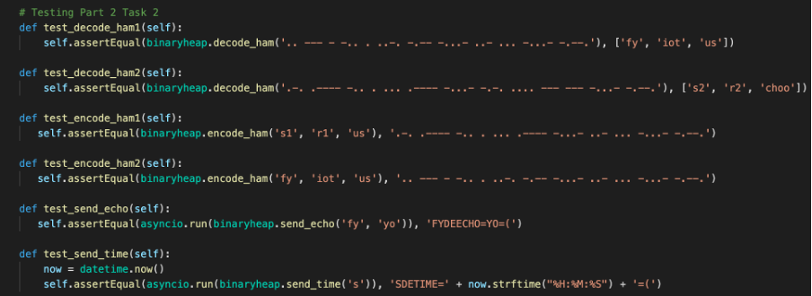

# iotworksheet2part2

## Part 2

### Task 1 - Binary Heaps

Heaps are binary trees in which each parent node has a value equal to or less than any of its offspring. For every k, counting items from zero, this implementation utilises arrays with heap[k]= heap[2*k+1] and heap[k]= heap[2*k+2]. Non-existing items are treated as infinite for the sake of comparison. The fact that a heap's smallest member is always the root, heap[0], is an intriguing trait.

the Binary Tree are I represented with a list of text, instead of a binary tree.

    # Binary Heap
    bheap = ['buffer', 'root', 'E', 'T', 'I', 'A', 'N', 'M', 'S', 'U', 'R', 'W', 'D', 'K', 'G', 'O', 'H', 'V', 'F', None, 'L', None, 'P', 'J', 'B', 'X', 'C', 'Y', 'Z', 'Q',
    None, None, '5', '4', None, '3', None, None, None, '2', None, None, '+', None, None, None, None, '1', '6', '=', '/', None, None, None, None, None, '7', None, None, None, 
    '8', None, '9', '0']

When using a binary tree to decode, it is necessary to "climb down" the tree by matching the dots and dashes to the given value inside the tree. To do so, a depth first search is employed, which concentrates on the left side of the tree before progressing to the right parts. The binary tree is represented in the heap as a string that virtually functions as a key.

unit teststing for task 1
    # Testing Part 2 Task 1 
    def test_decode_bt_pass(self):
       self.assertEqual(binaryheap.decode_bt('..- ...'), 'us')

    def test_decode_bt_fail(self):
        self.assertEqual(binaryheap.decode_bt('... ...'), 'fail')

### Task 2

#### encode_ham

This code part is a continuation of the original encode. In addition to a sender and recipient, it is meant to encode a message. It simply assembles the receiver, sender, and message in the desired format: receiver de sender =message=(, before encoding and eliminating trailing whitespaces.

    def encode_ham(sender, receiver, msg):
        output = receiver + 'de' + sender + '=' + msg + '=('
        output = encode(output)
        return output.rstrip()

#### decode_ham

the entire message is decoded as usual in decode_ham, but it is then broken down into three parts to determine which portion of the code represents which part of the message. The receiver of the message.. The sender is usually placed before the first =, whereas the message is placed after the first =.

    def decode_ham(code):
        output = []
        code = decode(code)
        code = code.split('de')
        receiver = code[0]
        code = code[1].split('=')
        output.append(code[0])
        output.append(receiver)
        output.append(code[1])
        return output

unit Testing for encode_ham and decode_ham

### Task 3

Each of these methods, like worksheet 1, connect to the server. Asynio can be used to execute asynchronous instructions. We establish a connection to port 10102, so that we can get our client id, and then transmit an encoded message.

The result of the functions will be an encoded string. It  decode it and send echo's message of the input, but send time's message is the current time in the format of HH:MM:SS. In order to for unittest to send time, it must use the datetime module rather than a static string to determine the current time.

    async def send_echo(sender, msg):
        uri = "ws://localhost:10101"
        morse = encode_ham(sender, 'echo', msg)

        async with websockets.connect(uri) as websocket:
            # Get Client ID
            message = json.loads(await websocket.recv())
            if message['type'] == 'join_evt':
                client_id = message['client_id'] 
                print('connected')

                await send_message(websocket, client_id, morse)
                print('sent: ' + morse)
                response = await recv_message(websocket)
        response = decode_ham(response)
        output = response[1] + 'de' + response[0] + '=' + response[2] + '=('
        return output.upper()

    async def send_time(sender):
        uri = "ws://localhost:10101"
        morse = encode_ham(sender, 'time', 'hello world')

        async with websockets.connect(uri) as websocket:
            message = json.loads(await websocket.recv())
            if message['type'] == 'join_evt':
                client_id = message['client_id'] 
                print('connected')

                await send_message(websocket, client_id, morse)
                print('sent: ' + morse)
                response = await recv_message(websocket)
                print(response)
        response = decode_ham(response)
        output = response[1] + 'de' + response[0] + '=' + response[2] + '=('
        return output.upper()
